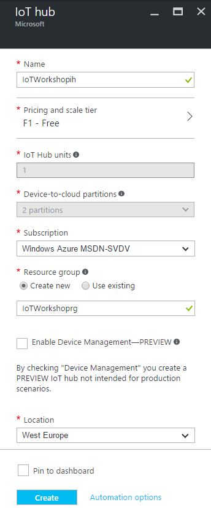

## Connecting to an IoT Hub using an UWP app


This is an example integration between an UWP app and Azure IoT Hub. This integration shows features like creating devices in the Azure IoT Hub device registry as well as sending telemetry to the IoT Hub.

*Note: in this workshop, we will create uniquely named Azure resources. The suggested names could be reserved already.*

*Note: The IoT Hub also offers sending commands back to devices. This is not part of this workshop.*

### Prerequisites

1. A Windows 10 computer with internet access
2. Visual Studio 2015 Community edition of higer [https://www.visualstudio.com/vs/community/](https://www.visualstudio.com/vs/community/)
3. Universal Windows App Development Tools (Windows SDK)[https://developer.microsoft.com/en-US/windows/downloads/windows-10-sdk](https://developer.microsoft.com/en-US/windows/downloads/windows-10-sdk)
4. Node.js [https://nodejs.org/en/](https://nodejs.org/en/). _(We prefer Version 6.6)_
5. Azure account [create here](https://azure.microsoft.com/en-us/free/) _([Azure passes](https://www.microsoftazurepass.com/howto) will be present for those who have no Azure account)_
6a. [IoT Hub Explorer](https://github.com/Azure/azure-iot-sdks/tree/master/tools/iothub-explorer) _(for Command-Line interface  based usage)_ 
6b. or [Device Explorer](https://github.com/Azure/azure-iot-sdks/blob/master/tools/DeviceExplorer/) _(for GUI based usage)_  

### Objectives

In this workshop you will learn

1. Creating an IoT Hub in the Azure Portal
2. Creating a new UWP App
3. Connect to the IoT Hub and register the app like a device
4. Generate and send dummy telemetry
5. Check the arrival of the telemetry

## Creating an Azure IoT Hub in the Azure portal


Follow these steps to create an Azure IoT Hub.

1. Log into the [Azure portal](https://portal.azure.com/). You will be asked to provide Azure credentials if needed
2. On the left, a number of common Azure services are shown. Select `More Services` to open a list with all available services

    

3. Filter it with `IoT Hub`

    

4. Select `IoT Hub` and a new blade will be shown. Select `Add` and you will be asked to enter the information needed to create an IoT Hub

    

5. Enter a unique IoT Hub name eg. `TechDays42ih`. A green sign will be shown if the name is unique
6. Enter a unique Resource Group eg. `TechDays42rg`. A green sign will be shown if the name is unique
7. Select `West Europe` for the location

    

8. Press `Create` and the portal will start creating the service. Once it is created, a notification is shown. In the right upper corner, a bell represents the list of all notifications shown

    

Creating an IoT Hub takes some time. Meanwhile, we will start with the app which will connect to the IoT Hub later on.


## creating a new UWP App

We will create a UWP app in Visual Studio. These apps are called Wniversal Windows Apps because they are supported by all sorts of devices running Windows 10. This includes laptops, PC's, Mobile devices like phones and tablets, the Xbox One, The Surface Hub, The Hololens and even the Raspberry Pi.

1. Start Visual Studio
2. On the Start Page or using the Menu, select New Project...

    


## Monitoring the arrival of the telemetry in Azure


We can check the arrival of messages in the Azure IoT Hub. This can be done using a UI app named Device Explorer or using a Command-Line tool named IoT Hub Explorer. `Choose one` 

### Monitoring using UI

We can check the arrival of the messages in the Azure IoT Hub using the Device Explorer. This tool is UI based, please check the installation requirements.

1. Start the `Device Explorer` from the desktop of using the start menu
2. On the Configuration Tab, insert the IoT Hub `Connection String-primary key` and the `name` of the IoT Hub (as Protocol Gateway Hostname)
3. Press `Update`
4. On the Management tab, your device should already be available. It was registered by the bridge the very first time, telemetry arrived
5. On the Data tab, Select your `Device ID` and press `Monitor`
6. This will result in the following messages

```
Receiving events...
09/23/16 21:43:47> Device: [goattrough], Data:[{"waterLevel":10}]
09/23/16 21:43:51> Device: [goattrough], Data:[{"waterLevel":15}]
09/23/16 21:43:53> Device: [goattrough], Data:[{"waterLevel":14}]
```

### Monitoring using Command-line

We can check the arrival of the messages in the Azure IoT Hub using the IoT Hub Explorer. This tool is Command-Line based, please check the installation requirements. 

*Note : See the [full example](https://github.com/Azure/azure-iot-sdks/tree/master/tools/iothub-explorer) for more options of this tool.*

1. Create a new folder eg. `c:\iothubexplorer`
2. In a dos-box, navigate to the new folder 
3. In this folder, run the following command `npm install -g iothub-explorer@latest` in your command-line environment, to install the latest (pre-release) version of the iothub-explorer tool
4. Login to the IoT Hub Explorer by supplying your IoT Hub *remembered* `Connection String-primary key` using the command `iothub-explorer login "[your connection string]"`
5. A session with the IoT Hub will start and it will last for approx. one hour:

    ```
    Session started, expires Tue Sep 27 2016 18:35:37 GMT+0200 (W. Europe Daylight Time)
    ```

6. To monitor the device-to-cloud messages from a device, use the following command `iothub-explorer "[your connection string]" monitor-events [device name]`  and `fill in` your  *remembered* 'Connection String-primary key' and *remember* device name
7. This will result in the following messages

    ```
    Monitoring events from device goattrough
    Event received:
    {
      "waterLevel": 12
    }
    ```